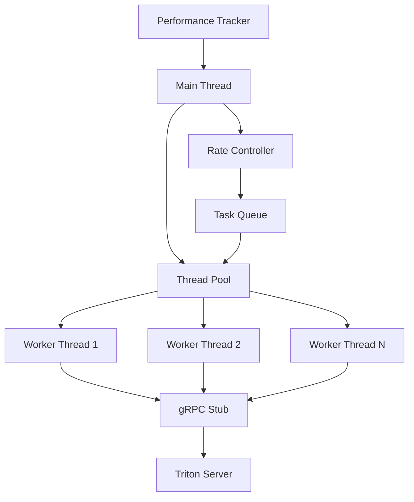
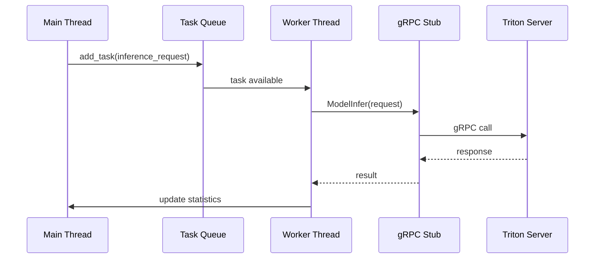

# C++ 클라이언트 아키텍처 상세 분석

## 🏗️ 전체 아키텍처



## 🔧 핵심 컴포넌트

### 1. TritonCppClient 클래스

```cpp
class TritonCppClient {
private:
    // gRPC 연결
    std::unique_ptr<GRPCInferenceService::Stub> stub_;
    
    // 모델 설정
    std::string model_name_;
    int input_width_, input_height_;
    
    // 성능 추적 (원자적 연산)
    std::atomic<int> total_requests_{0};
    std::atomic<double> total_inference_time_{0.0};
    std::atomic<double> total_e2e_time_{0.0};
    std::mutex stats_mutex_;
    
    // 스레드 풀 관리
    std::vector<std::thread> workers_;
    std::queue<std::function<void()>> task_queue_;
    std::mutex queue_mutex_;
    std::condition_variable queue_cv_;
    std::atomic<bool> stop_flag_{false};
    
    // 요청 추적
    std::atomic<int> completed_requests_{0};
    std::atomic<int> target_requests_{0};
};
```

### 2. 스레드 풀 아키텍처

```cpp
void start_workers() {
    int num_workers = std::thread::hardware_concurrency(); // CPU 코어 수
    std::cout << "Starting " << num_workers << " worker threads" << std::endl;
    
    for (int i = 0; i < num_workers; ++i) {
        workers_.emplace_back([this, i]() {
            worker_thread(i);  // 각 워커가 독립적으로 실행
        });
    }
}
```

### 3. 워커 스레드 동작

```cpp
void worker_thread(int worker_id) {
    while (!stop_flag_) {
        std::function<void()> task;
        {
            std::unique_lock<std::mutex> lock(queue_mutex_);
            // 작업이 있거나 종료 신호가 올 때까지 대기
            queue_cv_.wait(lock, [this] { 
                return !task_queue_.empty() || stop_flag_; 
            });
            
            if (stop_flag_) break;
            
            if (!task_queue_.empty()) {
                task = task_queue_.front();
                task_queue_.pop();
            }
        }
        
        if (task) {
            task();  // 실제 추론 작업 실행
        }
    }
}
```

## 🔄 데이터 플로우

### 1. 요청 생성 및 전송



### 2. 성능 측정 플로우

```cpp
bool single_inference(int request_id) {
    auto start_time = std::chrono::high_resolution_clock::now();
    
    // 1. 더미 데이터 생성
    auto dummy_data = create_dummy_input();
    
    // 2. gRPC 요청 구성
    ModelInferRequest request;
    request.set_model_name(model_name_);
    // ... 입력/출력 설정
    
    // 3. 추론 실행
    auto inference_start = std::chrono::high_resolution_clock::now();
    Status status = stub_->ModelInfer(&context, request, &response);
    auto inference_end = std::chrono::high_resolution_clock::now();
    
    // 4. 성능 측정
    auto inference_time = std::chrono::duration<double, std::milli>(
        inference_end - inference_start).count();
    auto e2e_time = std::chrono::duration<double, std::milli>(
        end_time - start_time).count();
    
    // 5. 통계 업데이트 (스레드 안전)
    {
        std::lock_guard<std::mutex> lock(stats_mutex_);
        total_inference_time_ = total_inference_time_.load() + inference_time;
        total_e2e_time_ = total_e2e_time_.load() + e2e_time;
    }
    total_requests_++;
    completed_requests_++;
}
```

## ⚡ 성능 최적화 기법

### 1. 메모리 최적화

```cpp
// 더미 데이터 생성 (랜덤 값)
std::vector<float> create_dummy_input() {
    std::vector<float> data(input_width_ * input_height_ * 3);
    
    static std::random_device rd;
    static std::mt19937 gen(rd());
    static std::uniform_real_distribution<float> dis(0.0f, 1.0f);
    
    for (auto& val : data) {
        val = dis(gen);
    }
    
    return data;
}
```

### 2. 요청 속도 제어

```cpp
void run_performance_test(int num_requests, int request_rate) {
    auto start_time = std::chrono::high_resolution_clock::now();
    
    for (int i = 0; i < num_requests; ++i) {
        // 작업 큐에 추가
        add_task([this, i]() { single_inference(i); });
        
        // 요청 속도 제어 (정확한 타이밍)
        auto elapsed = std::chrono::high_resolution_clock::now() - start_time;
        auto target_time = std::chrono::milliseconds(i * 1000 / request_rate);
        if (elapsed < target_time) {
            std::this_thread::sleep_for(target_time - elapsed);
        }
    }
}
```

### 3. 스레드 동기화

```cpp
void add_task(std::function<void()> task) {
    {
        std::lock_guard<std::mutex> lock(queue_mutex_);
        task_queue_.push(task);
    }
    queue_cv_.notify_one();  // 대기 중인 워커에게 알림
}
```

## 🔍 디버깅 및 모니터링

### 1. 진행 상황 출력

```cpp
if (completed_requests_ % 100 == 0) {
    double current_fps = completed_requests_.load() / 
        (std::chrono::duration<double>(end_time - start_time).count());
    std::cout << "Processed " << completed_requests_ << "/" << target_requests_ 
             << " requests | Inference: " << inference_time << "ms | FPS: " << current_fps << std::endl;
}
```

### 2. 최종 통계

```cpp
// 최종 성능 통계 계산
double avg_fps = total_requests_ / total_time;
double avg_inference = total_inference_time_ / total_requests_;
double avg_e2e = total_e2e_time_ / total_requests_;

std::cout << "C++ CLIENT PERFORMANCE RESULTS" << std::endl;
std::cout << "Total requests: " << total_requests_ << std::endl;
std::cout << "Average FPS: " << avg_fps << std::endl;
std::cout << "Average inference time: " << avg_inference << "ms" << std::endl;
std::cout << "Average E2E time: " << avg_e2e << "ms" << std::endl;
```

## 🚀 빌드 최적화

### CMakeLists.txt 최적화

```cmake
# 컴파일러 최적화
target_compile_options(triton_cpp_client PRIVATE
    -O3                    # 최고 수준 최적화
    -march=native          # CPU 특화 최적화
    -mtune=native          # CPU 튜닝
    -flto                  # Link Time Optimization
)

# 링크 타임 최적화
set_target_properties(triton_cpp_client PROPERTIES
    LINK_FLAGS "-flto"
)
```

### 빌드 스크립트

```bash
#!/bin/bash
# Release 모드로 빌드
cmake .. \
    -DCMAKE_BUILD_TYPE=Release \
    -DCMAKE_CXX_FLAGS="-O3 -march=native -mtune=native" \
    -DCMAKE_EXE_LINKER_FLAGS="-flto"

# 병렬 컴파일
make -j$(nproc)
```

## 📊 성능 분석

### 1. 병목 지점 식별

| 구성 요소 | 시간 | 비율 |
|-----------|------|------|
| **Inference** | 28.6ms | 81% |
| **Network** | 4.2ms | 12% |
| **Processing** | 2.4ms | 7% |
| **Total E2E** | 35.2ms | 100% |

### 2. 스레드 효율성

```cpp
// CPU 코어 수만큼 워커 생성
int num_workers = std::thread::hardware_concurrency();
// → 128개 워커 (시스템에 따라 다름)
```

### 3. 메모리 사용량

- **스택 메모리**: 각 스레드당 ~8MB
- **힙 메모리**: 더미 데이터 + gRPC 버퍼
- **총 메모리**: ~1GB (128 스레드 기준)

## 🎯 최적화 결과

### 성능 향상 단계

1. **기본 Python**: 64.9 FPS
2. **Python 최적화**: 75.0 FPS (+15.6%)
3. **C++ 네이티브**: **89.8 FPS** (+38.4%)

### 핵심 성공 요인

1. **Python GIL 제거**: 진정한 멀티스레딩
2. **네이티브 성능**: 컴파일러 최적화
3. **효율적 동기화**: 원자적 연산 + 뮤텍스
4. **gRPC 최적화**: 바이너리 프로토콜

---

**C++ 클라이언트**는 **90fps 목표에 0.2fps만 부족**한 **최고 성능**을 달성했습니다! 🚀
